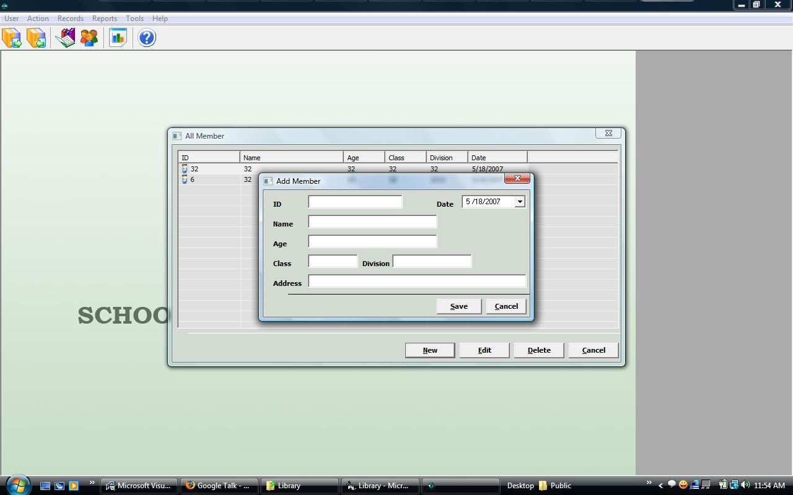



## School Library System

### Description

A simple software can help you to manage School Library system.I think this software help beginners to understand the world of professional coding,Vote me if u like....
 
### More Info
 

             |
---                |---
**Submitted On**   |2007-06-05 15:54:30
**By**             |[Sabith\.k\.p](https://github.com/Planet-Source-Code/PSCIndex/blob/master/ByAuthor/sabith-k-p.md)
**Level**          |Intermediate
**User Rating**    |4.8 (29 globes from 6 users)
**Compatibility**  |VB 4\.0 \(32\-bit\), VB 5\.0, VB 6\.0
**Category**       |[Complete Applications](https://github.com/Planet-Source-Code/PSCIndex/blob/master/ByCategory/complete-applications__1-27.md)
**World**          |[Visual Basic](https://github.com/Planet-Source-Code/PSCIndex/blob/master/ByWorld/visual-basic.md)
**Archive File**   |[School\_Lib2097351152008\.zip](https://github.com/Planet-Source-Code/sabith-k-p-school-library-system__1-69919/archive/master.zip)

